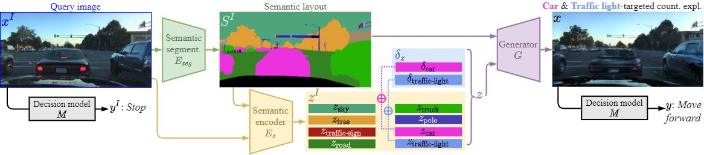

## Introduction
This is the official repository for the paper:

[STEEX: Steering Counterfactual Explanations with Semantics](https://arxiv.org/abs/2111.09094), Paul Jacob, Éloi Zablocki, Hédi Ben-Younes, Mickaël Chen, Patrick Pérez, Matthieu Cord, in proceedings of ECCV 2022

This repository contains all the code and instructions to:
- download and organize datasets
- train decision models on the datasets (with a densenet)
- train a semantic segmentation network on the datasets (with a DeepLabv3)
- train a semantic auto-encoder and generator (with SEAN)
- generate counterfactual explanations (with our method STEEX)
- evaluate obtained counterfactual explanations (with FID, MNAC and FVA)


**Figure:** *Counterfactual explanations with STEEX*

## Installation

Clone this repo.
```bash
git clone https://github.com/valeoai/STEEX.git
cd STEEX/
```

This code requires PyTorch (1.8.1), python 3+, and cuda (11.1). Please install dependencies by
```bash
pip install -r requirements.txt
```

All checkpoints are provided in the release, please extract them. It should look like this:
```
/path/to/checkpoints/decision_densenet
/path/to/checkpoints/deeplabv3
/path/to/checkpoints/sean
/path/to/checkpoints/oracle_attribute
/path/to/checkpoints/vggface2_pretrainings_for_oracle
```

## Dataset Preparation

This code uses four datasets: [CelebA](http://mmlab.ie.cuhk.edu.hk/projects/CelebA.html), [CelebAMask-HQ](https://github.com/switchablenorms/CelebAMask-HQ), [BDD100k](https://bair.berkeley.edu/blog/2018/05/30/bdd/), and the [BDD-OIA](https://github.com/Twizwei/bddoia_project) extension.
Please download and unzip the datasets from the respective websites.

To preprocess the masks for CelebAMask-HQ, please follow the intructions provided [here](https://github.com/switchablenorms/CelebAMask-HQ/tree/master/face_parsing).

To preprocess the CelebA dataset, like previous works, we crop and resize images to (128, 128) images. This is done with our script
```bash
python preprocess_celeba.py
```

 At the end, the dataset directory should look like this.
 
CelebAMask-HQ:
```
image_train     = "/path/to/dataset/CelebAMask-HQ/train/images"
mask_train      = "/path/to/dataset/CelebAMask-HQ/train/labels"
image_val       = "/path/to/dataset/CelebAMask-HQ/test/images"
attributes_path = "/path/to/dataset/CelebAMask-HQ/CelebAMask-HQ-attribute-anno.txt"
```

CelebA:
```
image_train     = "/path/to/dataset/celeba_squared_128/img_squared128_celeba_train"
image_val       = "/path/to/dataset/celeba_squared_128/img_squared128_celeba_test"
attributes_path = "/path/to/dataset/celeba_squared_128/list_attr_celeba.txt"
```

BDD-OIA:
```
bddoia_data    = "/path/to/dataset/bdd-oia/lastframe/data"
image_train    = "/path/to/dataset/bdd-oia/lastframe/train_25k_images_actions.json"
decision_train = "/path/to/dataset/bdd-oia/lastframe/train_25k_images_reasons.json"
image_val      = "/path/to/dataset/bdd-oia/lastframe/val_25k_images_actions.json"
decision_val   = "/path/to/dataset/bdd-oia/lastframe/val_25k_images_reasons.json"
```

BDD100k:
```
images_train = "/path/to/dataset/BDD/bdd100k/seg/images/train"
mask_train   = "/path/to/dataset/BDD/bdd100k/seg/labels/train"
images_val   = "/path/to/dataset/BDD/bdd100k/seg/images/val"
```

## Train decision models

For CelebA and CelebAMask-HQ, train the respective decision models (densenet) with the command below. Please, precise the data path `<data_dir>` and the checkpoint directory `<checkpoints_dir>`. To choose between CelabA and CelebAMask-HQ, simply toggle the commented code block on the top in the Args class.
```bash 
python train_decision_model_celeba_or_celebamhq.py
```

To train the decision model on BDD-OIA, run the command below. Please precise the data path `<data_dir>` and the checkpoint directory `<checkpoints_dir>`. 
```bash 
python train_decision_model_bdd.py
```

At the end, the checkpoints must be stored with the following structure:
```
/path/to/checkpoints/decision_densenet/celeba
/path/to/checkpoints/decision_densenet/celebamaskhq
/path/to/checkpoints/decision_densenet/bdd
```

## Train Semantic Segmentation Model

Train two semantic segmentation models, one for CelebaMask-HQ, one for BDD with the following command:
```bash
python train_deeplabv3.py
```
Simply specify the path to the checkpoints directory where the models will be saved (`checkpoints_dir` in the Args class) and toggle the commented block to switch from CelebAMask-HQ to BDD100K-seg. 

At the end, the checkpoints must be stored with the following structure:
```
/path/to/checkpoints/deeplabv3/celebamaskhq
/path/to/checkpoints/deeplabv3/bdd
```


## Generate Semantic Segmentation Masks on All Data

After the semantic segmentation models are trained, generate all masks for the validation splits of CelebaMask-HQ and BDD with the following script. Make sure to update the class Args at the top of the file, by specifying the `dataroot` path, the name of the segmentation network trained in the previous step `segmentation_network_name`, the path where the masks should be saved `save_dir_masks`.
```bash
python infer_masks.py
```

To generate semantic segmentation masks for CelebA, as this dataset has no ground-truth for semantic segmentation masks, first resize CelebA images to (256, 256), forward them in the DeepLabv3 network trained on CelebAMask-HQ, and resize down obtained masks back to the original (128, 128) resolution.

At the end, the masks should then be stored at:
- CelebA: `/path/to/dataset/celeba_squared_128/seg_squared128_celeba_val`
- CelebAMask-HQ: `/path/to/dataset/CelebAMask-HQ/test/predicted_masks`
- BDD100k: `/path/to/dataset/BDD/bdd100k/seg/predicted_masks/val`

## Train SEAN AutoEncoder

For CelebA and BDD, train a semantic SEAN AutoEncoder with the official github repository: https://github.com/ZPdesu/SEAN by specifying the data path to the image and to the semantic segmentation masks generated in the step above.
For CelebAMask-HQ, we used the [original SEAN weights](https://github.com/ZPdesu/SEAN#generating-images-using-pretrained-models) provided by the authors in their repository: `CelebA-HQ_pretrained`

At the end, the checkpoints must be stored with the following structure:
```
/path/to/checkpoints/sean/celeba
/path/to/checkpoints/sean/celebamaskhq
/path/to/checkpoints/sean/bdd
```

## Generating Counterfactual Explanations

Run the following commmand
```bash
python generate_counterfactuals.py --dataset_name <bdd_or_celeba_or_celebamhq> --checkpoints_dir <path_to_checkpoints_dir> --dataroot <path_to_dataroot> --name_exp <the_experience_name>
```

The `checkpoints_dir` contains the the checkpoints for the decision model as well as the sean encoder-decoder.
The `dataroot` is the folder where the data is stored.

The option `--target_attribute` specifies the class of interest. Keep the default value (0) for Move forward vs. Stop on BDD. For the face datasets (CelebA and CelebAMask-HQ), `--target_attribute 1` is for the Smile classification and `--target_attribute 2` is for the Young classification.

The general setting targets all regions. To generate *region-targeted* counterfactual explanations, you can specify the regions (separated by commas) with the option `--specified_regions`. See at the top of the file `generate_counterfactual.py` the list of possible regions.
For example, for CelebA or CelebAMask-HQ: `--specified_regions skin,nose,glasses`. For BDD: `--specified_regions road,car,motorcycle`.

The whole list of options is available in the `options/` folder.


## Evaluation

1. **Success Rate**

To get the succes rate, run the following command: 
```bash
python compute_success_rate.py --expe </path/to/results_dir/name_exp>
```

2. **Fréchet Inception Distance (FID)**

Run the following bash command to get the FID score:
```bash
python compute_fid.py --expe </path/to/results_dir/name_exp>
```
The processed folders are the query images resized to the correct dimension. They can be obtained (and then moved to the path indicated in the `compute_fid.py` file) by using the flag `--save_query_image True` in the script `generate_counterfactuals.py`.

3. **Face Verification Accuracy (FVA)**

Run the following bash command to get the FVA score:
```bash
python compute_fva.py --expe </path/to/results_dir/name_exp>
```

4. **Mean Number of Attribute Changes (MNAC)**

4.1. The first time, you need to train the VGGFace2 oracle model on the 40 attributes for both CelebA and CelebAMask-HQ. The training is done by the file `train_vggface2_oracle.py`. Train both an oracle for CelebA with `--celeba_or_celebamhq celeba` and CelebAMask-HQ with `--celeba_or_celebamhq celebamhq`.
```bash
python train_vggface2_oracle.py --dataroot </path/to/dataroot> --checkpoint_dir </path/to/checkpoints/dir>
```

At the end, the checkpoints must be stored with the following structure:
```
/path/to/checkpoints/oracle_attribute/celeba
/path/to/checkpoints/oracle_attribute/celebamaskhq
```


4.2. When the oracle model is trained and saved, simply put the oracle name at the top of the `compute_mnac.py` file (placeholder `<oracle_name>`)
Run the following bash command to get the MNAC score. 
```bash
python compute_mnac.py --expe </path/to/results_dir/name_exp> --checkpoint_dir </path/to/checkpoints/dir>
```

## Disclaimer

There might be some bugs or errors. Feel free to open an issue and/or contribute to improve the repo.

## Citation

If the code helped you for your research, please consider citing
```
@inproceedings{steex,
  author    = {Paul Jacob and
               {\'{E}}loi Zablocki and
               Hedi Ben{-}Younes and
               Micka{\"{e}}l Chen and
               Patrick P{\'{e}}rez and
               Matthieu Cord},
  title     = {{STEEX:} Steering Counterfactual Explanations with Semantics},
  booktitle = {ECCV},
  year      = {2022},
}
```
